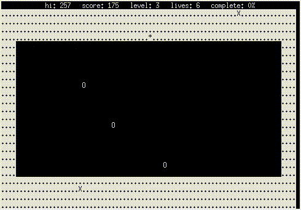

# xonips

Just yet another XONIX game. 

The Powershell version works both on Windows and Linux platforms.

## Keyboard

Key | Action
-|-
[🡹] or [W] | up
[🡸] or [A] | left 
[🡻] or [S] | down
[🡺] or [D] | right 
[␣] | stop
[P] | pause
[Q] | quit
